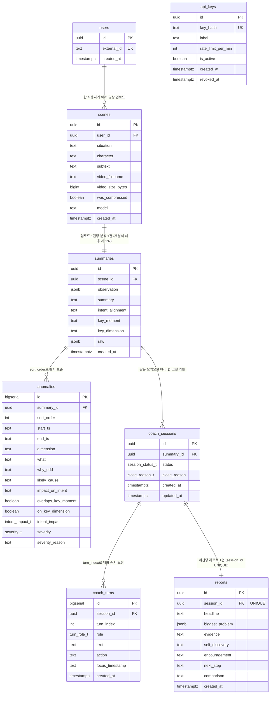

# DB 스키마 (PostgreSQL) — 확정

현재는 코치 세션이 인메모리, 리포트가 JSON 파일이라 재배포 때마다 데이터가 사라진다. **PostgreSQL**로 이관한다 — 가변 구조(observation, biggest_problem)는 JSONB로, 조회·비교가 필요한 필드는 컬럼으로 승격했다.

**확정된 스택·환경** (2026-07 설계 리뷰):

- 개발은 **로컬 PostgreSQL**, 추후 **AWS로 이전** 예정. 접속은 `DATABASE_URL` 환경 변수로 추상화하고, 미설정 시 부팅 실패(fail-fast — `API_KEYS` fail-closed 패턴과 일관)
- **SQLAlchemy 2.0 (sync) + psycopg3** — 코치·리포트 핸들러가 sync `def`인 현재 구조와 일치
- 마이그레이션은 **Alembic** (초기 리비전 1개로 시작, AWS 이전 시 `alembic upgrade head`로 재현)
- 모델·엔진·alembic·Postgres store 구현체는 **acting-api에 집중**, 게이트웨이가 하위 서비스 라우터에 store를 주입하는 기존 패턴 유지
- API는 **클린 브레이크** — 통째 전달 방식과의 과도기 dual-accept 없음 ([api-changes.md](api-changes.md) 참고)

DB 도입 후 API 요청 형태 변화는 [api-changes.md](api-changes.md) 참고. 관련 이슈: [#1](https://github.com/acttub/acting-api-deploy/issues/1)

## 현재 저장소 → 제안 테이블 매핑

| 현재 | 문제 | 이관 대상 |
|---|---|---|
| 코치 세션 (인메모리 dict) | 재시작 시 소멸 → 404 | `coach_sessions` + `coach_turns` |
| `reports.json` 파일 | 휘발성 디스크, 동시 쓰기 경합 | `reports` |
| `/summarize` 결과 (저장 안 함) | 클라이언트가 유실하면 재분석 필요 | `scenes` + `summaries` + `anomalies` |
| `API_KEYS` 환경 변수 | 키 추가·폐기마다 재배포 | `api_keys` |
| `user_id` (자유 문자열) | 무결성 보장 없음 | `users` |

## ERD



## DDL

```sql
CREATE TYPE intent_impact_t AS ENUM ('반전', '약화', '국소');
CREATE TYPE severity_t AS ENUM ('high', 'mid', 'low');
CREATE TYPE session_status_t AS ENUM ('open', 'closed');
CREATE TYPE close_reason_t AS ENUM ('gap_stated', 'exhausted', 'limit', 'user_ended');
CREATE TYPE turn_role_t AS ENUM ('ai', 'actor');

CREATE TABLE users (
  id            uuid PRIMARY KEY DEFAULT gen_random_uuid(),
  external_id   text NOT NULL UNIQUE,          -- 현재 API의 user_id. 처음 보는 값이면 자동 생성(get-or-create)
  created_at    timestamptz NOT NULL DEFAULT now()
);

CREATE TABLE api_keys (
  id                  uuid PRIMARY KEY DEFAULT gen_random_uuid(),
  key_hash            text NOT NULL UNIQUE,    -- 평문 저장 금지, SHA-256
  label               text NOT NULL,
  rate_limit_per_min  int  NOT NULL DEFAULT 10,
  is_active           boolean NOT NULL DEFAULT true,
  created_at          timestamptz NOT NULL DEFAULT now(),
  revoked_at          timestamptz
);

CREATE TABLE scenes (
  id                uuid PRIMARY KEY DEFAULT gen_random_uuid(),
  user_id           uuid NOT NULL REFERENCES users(id),  -- /summarize가 user_id를 필수로 받음
  situation         text NOT NULL,
  character         text NOT NULL,
  subtext           text NOT NULL,
  video_filename    text,
  video_size_bytes  bigint,
  was_compressed    boolean NOT NULL DEFAULT false,
  model             text NOT NULL,              -- 분석에 쓴 Gemini 모델
  created_at        timestamptz NOT NULL DEFAULT now()
);

CREATE TABLE summaries (
  id                uuid PRIMARY KEY DEFAULT gen_random_uuid(),
  scene_id          uuid NOT NULL REFERENCES scenes(id) ON DELETE CASCADE,
  observation       jsonb NOT NULL,            -- timeline/dialogue/tempo/... + extra[]
  summary           text NOT NULL,
  intent_alignment  text NOT NULL,
  key_moment        text NOT NULL,
  key_dimension     text NOT NULL,
  raw               jsonb NOT NULL,            -- SceneSummary 원본 — 사본 스키마 불일치 대비
  created_at        timestamptz NOT NULL DEFAULT now()
);

CREATE TABLE anomalies (
  id                   bigserial PRIMARY KEY,
  summary_id           uuid NOT NULL REFERENCES summaries(id) ON DELETE CASCADE,
  sort_order           int NOT NULL,           -- 서버가 계산한 정렬 순서 보존
  start_ts             text NOT NULL,          -- "MM:SS" 표기 유지
  end_ts               text NOT NULL,
  dimension            text NOT NULL,
  what                 text NOT NULL,
  why_odd              text NOT NULL,
  likely_cause         text NOT NULL,
  impact_on_intent     text NOT NULL,
  overlaps_key_moment  boolean NOT NULL DEFAULT false,
  on_key_dimension     boolean NOT NULL DEFAULT false,
  intent_impact        intent_impact_t NOT NULL,
  severity             severity_t NOT NULL,
  severity_reason      text NOT NULL
);

CREATE TABLE coach_sessions (
  id              uuid PRIMARY KEY,             -- 기존 session_id 그대로 사용
  summary_id      uuid NOT NULL REFERENCES summaries(id),  -- 클린 브레이크라 통째-summary 세션이 없어 NOT NULL 가능
  -- user_id 컬럼 없음: summary_id → summaries → scenes.user_id로 파생 (설계 노트 참고)
  -- subtext 컬럼 없음: summary_id → scenes 조인으로 situation/character/subtext 조회
  -- question_count 컬럼 없음: coach_turns에서 COUNT로 파생 (설계 노트 참고)
  status          session_status_t NOT NULL DEFAULT 'open',
  close_reason    close_reason_t,
  created_at      timestamptz NOT NULL DEFAULT now(),
  updated_at      timestamptz NOT NULL DEFAULT now()
);

CREATE TABLE coach_turns (
  id               bigserial PRIMARY KEY,
  session_id       uuid NOT NULL REFERENCES coach_sessions(id) ON DELETE CASCADE,
  turn_index       int NOT NULL,
  role             turn_role_t NOT NULL,
  text             text NOT NULL,
  action           text,                        -- ai 턴만: probe_intent 등
  focus_timestamp  text NOT NULL DEFAULT '',
  created_at       timestamptz NOT NULL DEFAULT now(),
  UNIQUE (session_id, turn_index)
);

CREATE TABLE reports (
  id               uuid PRIMARY KEY DEFAULT gen_random_uuid(),
  -- user_id 컬럼 없음: session → summary → scene → user 사슬로 파생 (설계 노트 참고)
  session_id       uuid NOT NULL UNIQUE REFERENCES coach_sessions(id),
  headline         text NOT NULL,
  biggest_problem  jsonb NOT NULL,              -- {start, end, dimension, description}
  evidence         text NOT NULL,
  self_discovery   text NOT NULL,
  encouragement    text NOT NULL,
  next_step        text NOT NULL,
  comparison       text NOT NULL DEFAULT '',
  created_at       timestamptz NOT NULL DEFAULT now()
);

-- 조회 패턴에 맞춘 인덱스
-- 리포트 이력·latest 비교는 user → scenes → summaries → coach_sessions → reports 조인 경로.
-- 사슬의 각 FK에 인덱스를 둬서 조인 비용을 잡는다.
CREATE INDEX idx_turns_session ON coach_turns (session_id, turn_index);
CREATE INDEX idx_anomalies_summary ON anomalies (summary_id, sort_order);
CREATE INDEX idx_scenes_user ON scenes (user_id, created_at DESC);
CREATE INDEX idx_summaries_scene ON summaries (scene_id);
CREATE INDEX idx_sessions_summary ON coach_sessions (summary_id);
```

## 설계 노트

공통 기준: **단일 진실 원천 — 파생 가능한 값은 저장하지 않는다.**

| 결정 | 이유 |
|---|---|
| `observation` · `biggest_problem`을 JSONB로 | 내부 구조가 프롬프트 개선에 따라 자주 바뀌는 영역이라, 컬럼 승격은 조회·정렬에 실제로 쓰는 필드로 한정 |
| `summaries.raw`에 원본 JSON 보존 | 세 서비스에 수동 복사된 `SceneSummary` 사본이 서로 달라 필드가 탈락하는 문제가 있음(API.md 참고). 원본을 통째로 남기면 스키마가 바뀌어도 재처리 가능 |
| `anomalies`를 별도 테이블로 정규화 | severity·구간 기준 조회와 통계(자주 걸리는 축 분석 등)를 SQL로 바로 가능. 순서는 `sort_order`로 보존 |
| 타임스탬프(`start_ts`)를 text로 유지 | 모델 출력이 `"MM:SS"` 문자열이라 그대로 저장하는 게 안전. 초 단위 정렬이 필요해지면 `start_seconds int` 생성 컬럼 추가 |
| `reports.session_id`에 UNIQUE | 같은 세션으로 리포트 중복 생성을 DB 레벨에서 차단. `report_count`는 `COUNT(*)`로 대체 |
| `coach_sessions.user_id`·`reports.user_id` 없음 | 클린 브레이크로 `reports → session → summary → scene → user` 사슬이 항상 성립해 둘 다 파생 가능. 서버가 INSERT 시점에 사슬에서 도출하므로 위조 경로도 없음. 이력 조회(`/report/history`)는 사슬 FK 인덱스를 타는 조인으로 대체 — 데이터 규모(사용자당 리포트 수십 건)에서 비용 무시 가능 |
| `users`는 get-or-create | 회원 개념이 없어 처음 보는 `external_id`면 `/summarize`에서 자동 생성(`INSERT ... ON CONFLICT DO NOTHING`). 인증/회원이 생기면 그때 잠금 |
| `api_keys.key_hash`로 키 관리 이관 | 키 발급·폐기에 재배포 불필요, 키별 레이트리밋(`rate_limit_per_min`)으로 전역 `RATE_LIMIT_PER_MIN` 대체. 발급·폐기·목록은 CLI 스크립트로(발급 시 평문 1회 출력), `API_KEYS` 환경 변수 지원은 제거. 레이트리밋 카운터 자체는 DB가 아니라 인메모리/Redis에 유지 |
| `users.display_name` 없음 | 현재 API에 이 값을 받는 입력이 없음. 회원 개념이 생기면 그때 추가 |
| `coach_sessions.subtext` 없음 | situation/character/subtext는 이미 `scenes`에 컬럼으로 저장됨. 코치가 필요하면 `summary_id → scenes` 조인으로 조회. 세션에 또 저장하면 중복 + 두 값이 어긋날 가능성만 생김 |
| `coach_sessions.question_count` 없음 | `coach_turns`에서 파생: `SELECT COUNT(*) FROM coach_turns WHERE session_id = ? AND role = 'ai' AND action <> 'close'` (증가 규칙 근거: `acting_agent/src/acting_agent/engine.py:56,106-107`). 세션당 턴 최대 20여 개 + `idx_turns_session` 인덱스라 COUNT 비용 무시 가능 |
| `reports`에 `turns` 사본·`report_count` 없음 | 대화는 `coach_turns` 조회로, 개수는 `COUNT(*)`로 대체 |
| 영상 파일은 DB 밖에 | 영상 원본은 저장하지 않거나 S3 같은 오브젝트 스토리지에 두고, DB에는 메타데이터(`scenes`)만 저장 |

### 저장 시점 규칙

- `summaries`/`anomalies`는 **`/summarize` 시점에 1회 INSERT, 이후 불변**
- `overlaps_key_moment`/`on_key_dimension`/`intent_impact` 세 필드는 acting-summary 내부에서 severity 점수 합산(`summarizer.py:38-42`)에만 쓰이고 하류에선 미사용. 사본 스키마 파싱 시 탈락해도 기능상 무해하지만, **코치/리포트 단계의 객체로 UPDATE/UPSERT하면 참값이 기본값(false/NULL)으로 덮임**. 분석 결과는 불변 데이터로 취급할 것

## 도입 범위 (확정)

당초 4단계 점진 도입을 제안했으나, **한 브랜치(feat/introduce-db-and-api-id-reference)에서 전부 도입**하기로 확정:

1. `reports` 이관 — 이력 유실 해결
2. `coach_sessions`/`coach_turns` — 재배포 후 404 해결
3. `scenes`/`summaries`/`anomalies` — 재분석 비용 절감 + API 참조 방식 전환
4. `api_keys` — 환경 변수 방식 제거, CLI 발급으로 전환

기존 데이터는 이관하지 않는다(로컬 데모 데이터뿐이고 Render 디스크는 어차피 휘발성). `InMemorySessionStore`는 테스트용 fake로 재활용하고, `FileReportStore`와 `REPORT_STORE_PATH` 설정은 삭제한다. 하위 서비스 단독 gradio 데모는 이번 범위 밖 — 게이트웨이 + DB 경유로만 동작한다.

## 향후 확장 — 같은 연습의 반복 업로드 추적 (practices)

현재 `comparison`은 "같은 사용자의 직전 리포트"와 비교라서, 서로 다른 장면끼리도 비교된다. 같은 연기 연습을 반복 업로드하며 성장을 추적하는 기능이 생기면, 비교 범위를 연습 단위로 좁혀야 한다. **기존 8개 테이블은 컬럼 하나 바뀌지 않고**, 아래 두 가지 추가만으로 확장된다.

### 추가 DDL

```sql
-- 1. 연습(작품/장면) 묶음 테이블
CREATE TABLE practices (
  id          uuid PRIMARY KEY DEFAULT gen_random_uuid(),
  user_id     uuid NOT NULL REFERENCES users(id),
  title       text NOT NULL,          -- "이별 장면", "햄릿 독백"
  created_at  timestamptz NOT NULL DEFAULT now()
);

-- 2. scenes에 소속 FK 추가 (nullable — 기존 데이터 호환)
ALTER TABLE scenes ADD COLUMN practice_id uuid REFERENCES practices(id);
```

### 기존 테이블이 안 바뀌는 이유 — FK 사슬

리포트가 어느 연습에 속하는지는 이미 유지 중인 FK 사슬로 도출된다. `reports`에 `practice_id`를 또 넣으면 중복 저장이다.

```
reports → session_id → coach_sessions → summary_id
        → summaries → scene_id → scenes → practice_id
```

### comparison용 "직전 리포트" 쿼리 변화

```sql
-- 기존: 같은 사용자의 최신 리포트 / 변경: 같은 연습의 최신 리포트
SELECT r.* FROM reports r
JOIN coach_sessions cs ON cs.id = r.session_id
JOIN summaries s ON s.id = cs.summary_id
JOIN scenes sc ON sc.id = s.scene_id
WHERE sc.practice_id = ?
ORDER BY r.created_at DESC LIMIT 1;
```

선택 사항: `reports.compared_report_id uuid FK (nullable)`를 추가하면 "이 comparison이 어느 리포트와 비교한 결과인지" 출처가 남는다. "3번째 시도 vs 7번째 시도 비교" 같은 UI가 생길 때 재현 가능해진다. anomalies가 정규화돼 있으니 "시도를 거듭할수록 템포 이상이 줄어드는가" 같은 성장 추적 쿼리도 SQL로 바로 가능하다.
