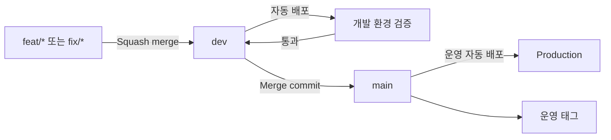
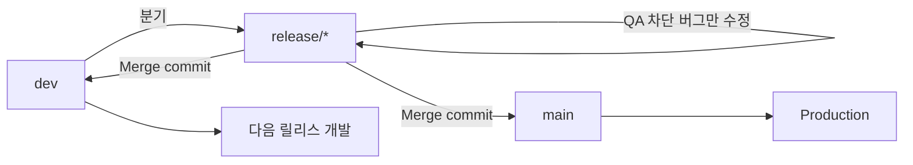
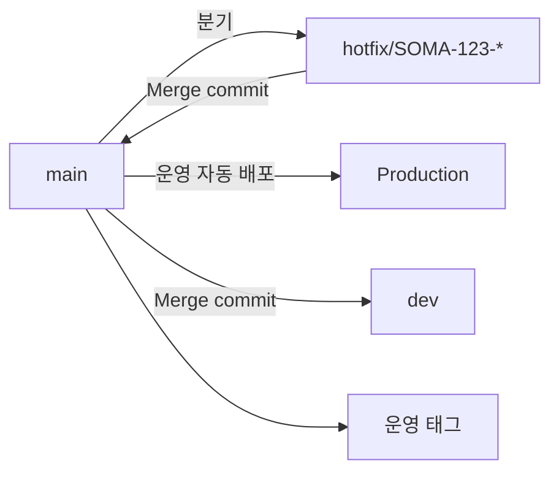
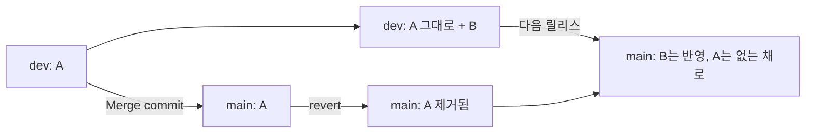

# 브랜치·릴리스 전략

이 문서는 Acttub 플랫폼의 개발 통합, 릴리스, 긴급 수정 흐름의 정본입니다.
목표는 `dev`에서 검증한 변경을 예측 가능한 단위로 운영에 올리고, 운영과 개발
브랜치의 내용이 갈라지는 일을 막는 것입니다.

배포 인프라와 자동 배포로 간 배경은 [DEPLOY-VPC.md](DEPLOY-VPC.md) 6-5에 있습니다.

## 원칙

- `main`은 현재 운영에 배포된 코드입니다. `main` 머지는 곧 운영 릴리스입니다.
- `dev`는 다음 릴리스를 통합·검증하는 브랜치이며 항상 릴리스 가능한 상태를
  유지합니다.
- 작업 브랜치는 짧게 유지하고, 미완성 기능은 장기 브랜치 대신 feature flag로
  숨깁니다.
- 일반 릴리스는 검증된 `dev` 전체를 `main`으로 승격합니다. 커밋을 골라
  cherry-pick해서 별도의 릴리스 이력을 만들지 않습니다.
- `release/*`는 QA 중에도 `dev`에 다음 개발을 계속 합쳐야 할 때만 만드는 임시
  안정화 브랜치입니다.
- `hotfix/*`는 미출시 변경이 섞이지 않도록 반드시 `main`에서 시작합니다.
- `main`과 `dev`에는 직접 push하지 않고 CI를 통과한 PR로만 합칩니다.
- `main`에서 시작한 변경(hotfix, revert)은 반드시 `dev`로 역병합합니다.

## 브랜치 역할과 수명

| 브랜치 | 시작점 | 용도 | 종료 |
| --- | --- | --- | --- |
| `main` | 장기 유지 | 운영에 배포된 정확한 이력 | 삭제하지 않음 |
| `dev` | 장기 유지 | 다음 릴리스 통합 및 개발 환경 배포 | 삭제하지 않음 |
| `feat/SOMA-123-short-name` | `dev` | 하나의 기능 또는 이슈 | `dev` 머지 후 삭제 |
| `fix/SOMA-123-short-name` | `dev` | 아직 운영되지 않은 코드의 수정 | `dev` 머지 후 삭제 |
| `release/YYYY-MM-DD[-slug]` | `dev` | 릴리스 후보 동결 및 QA 차단 버그 수정 | `main`, `dev` 반영 후 삭제 |
| `hotfix/SOMA-123-short-name` | `main` | 운영 장애나 긴급 결함 수정 | `main`, `dev` 반영 후 삭제 |

## Merge 방식

| PR | Merge 방식 | 이유 |
| --- | --- | --- |
| `feat/*`, `fix/*` → `dev` | Squash merge | Jira 이슈 하나를 되돌릴 수 있는 커밋 하나로 유지 |
| `dev` → `main` | Merge commit | 릴리스 경계와 포함된 개발 이력을 보존 |
| `release/*` → `main` | Merge commit | 검증한 릴리스 후보의 경계를 보존 |
| `release/*` → `dev` | Merge commit | 릴리스 중 수정과 조상 관계를 개발선에 그대로 반영 |
| `hotfix/*` → `main` | Merge commit | `main` ruleset이 merge commit만 허용 |
| `main` → `dev` | Merge commit | hotfix·revert 등 운영에서 시작한 변경과 조상 관계를 보존 |

`main` 대상 PR은 ruleset(`Require merge commits for main (release)`)이 merge
commit만 허용합니다. GitHub은 출발 브랜치별로 merge 방식을 나눌 수 없으므로
hotfix도 예외가 아닙니다. 긴급 수정을 커밋 하나로 남기고 싶으면 PR을 열기 전에
로컬에서 정리합니다.

`main`을 `dev`에 역병합할 때도 squash·rebase를 쓰지 않습니다. 동일한 변경을 다른
SHA로 복제하면 이후 revert와 충돌 판단이 어려워집니다.

## 일반 릴리스

일반적인 선택입니다. `dev`의 모든 변경을 함께 출시할 수 있을 때 별도
`release/*` 브랜치를 만들지 않습니다.

1. 작업 브랜치를 `dev`에서 만들고 PR을 Squash merge합니다.
2. 개발 환경에서 통합 동작과 하위 호환성을 확인합니다.
3. 출시 범위가 확정되면 `dev`에서 `main`으로 릴리스 PR을 엽니다. 아래 링크로
   열면 릴리스 전용 템플릿이 붙습니다.
   <https://github.com/acttub/acttub-platform/compare/main...dev?template=release.md>
4. CI, DB 마이그레이션 순서, 프론트/API 호환성, 롤백 지점을 확인합니다.
5. Merge commit으로 합칩니다. 이 시점에 운영 자동 배포가 시작됩니다.
6. 성공한 운영 커밋에 `prod-YYYY.MM.DD.N` 형식의 annotated tag를 붙입니다.

일반 릴리스에는 `main` → `dev` 역병합이 필요하지 않습니다. 릴리스 PR이
`dev`의 이력을 그대로 포함하며, `main`에서 별도 변경을 만들지 않기 때문입니다.

`main`에서 revert를 했다면 이 문장은 더 이상 성립하지 않습니다. 아래
[운영 롤백](#운영-롤백)을 따릅니다.

## 안정화가 필요한 릴리스

QA가 진행되는 동안 다음 릴리스 개발을 `dev`에 계속 합쳐야 할 때만 사용합니다.

1. 릴리스 범위를 포함한 `dev` 커밋에서 `release/YYYY-MM-DD[-slug]`를 만듭니다.
2. 브랜치를 만든 뒤에는 새 기능을 추가하지 않습니다. QA를 막는 수정만 직접
   반영합니다.
3. 같은 수정이 필요하다고 `dev`에 따로 다시 구현하거나 cherry-pick하지 않습니다.
4. 검증이 끝나면 `release/*`를 `main`에 Merge commit으로 합칩니다.
5. 운영 배포를 확인한 직후 같은 `release/*`를 `dev`에 Merge commit으로 합칩니다.
6. 운영 태그를 만들고 원격 `release/*` 브랜치를 삭제합니다.

현재 `.github/workflows/deploy.yml`은 `dev`와 `main`만 자동 배포합니다. 따라서
`release/*`를 만드는 것만으로 별도 staging 환경이 생기지는 않습니다. 호스팅된
릴리스 후보를 QA하려면 release 브랜치용 staging 배포를 별도 작업으로 추가해야
합니다. 그 전에는 Actions의 수동 운영 배포에서 `release/*` ref를 선택해 시험하지
않습니다.

## Hotfix

1. 최신 `main`에서 `hotfix/SOMA-123-short-name`을 만듭니다.
2. 긴급 수정과 필요한 회귀 테스트만 포함한 PR을 `main`으로 엽니다. 커밋이
   여러 개면 PR을 열기 전에 로컬에서 정리합니다.
3. Merge commit으로 합치고 운영 배포를 확인한 뒤 태그를 붙입니다.
4. 즉시 `main` → `dev` PR을 Merge commit으로 합칩니다.
5. 열려 있는 `release/*`가 있다면 `main`을 해당 브랜치에도 Merge commit으로
   합치고 다시 QA합니다.

`dev`에는 미출시 변경이 있으므로 hotfix를 `dev`에서 만들거나 `dev` 전체를
hotfix와 함께 운영에 올리지 않습니다.

## 운영 롤백

`main`에서 revert한 변경은 `dev`에 원본이 그대로 남습니다. 이 상태로 다음
릴리스를 하면 revert가 되살아나는 것이 아니라, **그 변경이 운영에서만 조용히
빠진 채로 남습니다.** `dev`에는 코드가 멀쩡히 있으므로 코드를 봐도 PR을 봐도
드러나지 않습니다.

merge base 이후 `dev`가 그 파일을 건드리지 않았다면 Git은 `main` 쪽의 삭제를
그대로 유지하기 때문입니다. 이 저장소에서 실제로 조용한 삭제 3건과 잘못된
되돌림 20건이 생겨 `SOMA-402`(PR #218)에서 `-s ours` 역머지로 수습했습니다.

1. `main`에서 revert PR을 열고 Merge commit으로 합칩니다.
2. 운영 배포와 장애 해소를 확인합니다.
3. **즉시** `main` → `dev` PR을 Merge commit으로 합칩니다. 이 단계를 건너뛰면
   위 사고가 그대로 발생합니다.
4. 열려 있는 `release/*`가 있다면 거기에도 `main`을 Merge commit으로 합칩니다.
5. 되돌린 변경을 다시 넣을 때는 `dev`에서 revert를 revert하는 PR을 새로 엽니다.
   원본 커밋을 cherry-pick하지 않습니다.

같은 revert를 `main`과 `dev`에 각각 따로 만들지 않습니다. 동일한 변경을 다른
SHA로 복제하면 이후 충돌 판단이 어려워집니다.

## PR과 Jira

- 작업 및 hotfix 브랜치와 PR에는 `SOMA-123` 형식의 이슈 키를 넣습니다.
- 여러 이슈를 묶는 릴리스 브랜치는 Jira 단일 키 규칙의 예외입니다.
- 릴리스 PR 제목은 `release: YYYY-MM-DD <요약>`으로 쓰고, 본문에 포함한 Jira
  이슈 키와 제외·연기한 항목을 나열합니다.
- 릴리스 PR에는 최소한 다음 정보를 남깁니다.
  `.github/PULL_REQUEST_TEMPLATE/release.md`가 이 형태입니다.
  - 포함한 변경과 Jira 이슈
  - 사용자 영향과 수동 확인 결과
  - Flyway 파일 및 expand/contract 단계
  - 프론트/API 간 하위 호환 여부
  - 직전 운영 태그와 코드 롤백 지점

## DB와 배포 안전성

- Flyway 마이그레이션은 애플리케이션 기동의 일부이므로 Git revert가 DB까지
  되돌리지는 않습니다.
- 스키마 변경은 expand → 호환 코드 배포 → 데이터 전환 → contract 순으로 여러
  릴리스에 나눕니다.
- 컬럼·테이블 삭제와 이를 사용하지 않는 코드를 한 릴리스에 묶지 않습니다.
- 프론트와 API는 병렬 배포되어도 구버전과 신버전 조합이 동작해야 합니다.
- 운영 배포 실패 시 직전 운영 태그로 코드를 되돌리되, 적용된 마이그레이션과
  데이터는 별도로 안전성을 판단합니다.
- `main`에서 revert로 되돌렸다면 [운영 롤백](#운영-롤백)의 역병합까지가 한
  묶음입니다. 코드만 되돌리고 멈추면 `dev`와 운영이 갈립니다.

## 보호 규칙

- `main`, `dev`: direct push와 force push 금지, required CI 통과 후 PR merge
- `main` 대상 PR: 운영 영향과 롤백 계획을 리뷰한 뒤 merge
- `release/*`, `hotfix/*`: 목적 달성 후 원격 브랜치 삭제
- 운영 태그: 이동하거나 재사용하지 않음
