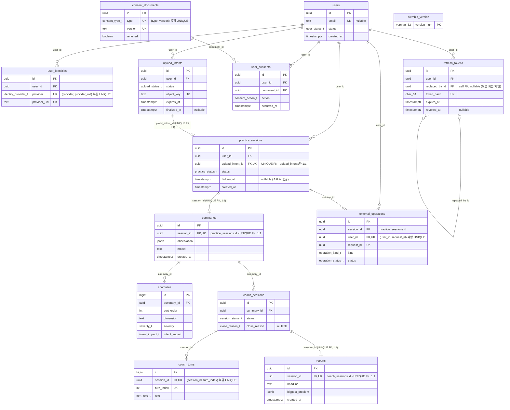

# 데이터베이스 ERD

acting-api가 사용하는 PostgreSQL `public` 스키마의 엔티티 관계도입니다.

- 소스: 로컬 PostgreSQL `acting_local` DB 직접 조회 (2026-07-22, alembic 리비전 `0004_unique_summary_per_session`)
- 코드 정의: [`apps/api/acting-api/src/acting_api/db/models.py`](../apps/api/acting-api/src/acting_api/db/models.py)
- 테이블 14개. 가독성을 위해 각 테이블은 PK/FK와 주요 컬럼만 표기했습니다 (전체 컬럼은 models.py 참고).

## 다이어그램



## 핵심 체인

```
users → practice_sessions → summaries → coach_sessions (→ coach_turns) → reports
```

연습 영상 업로드(`upload_intents`) → 연습 세션 생성(`practice_sessions`) → AI 분석 결과(`summaries`, 이상 징후는 `anomalies`) → 코칭 대화(`coach_sessions`/`coach_turns`) → 최종 리포트(`reports`) 순으로 이어집니다.

## 기수성 요약

| 관계 | 기수성 | 근거 |
| --- | --- | --- |
| users → user_identities | 1:N | `user_identities.user_id` FK. `(provider, provider_uid)` 복합 UNIQUE로 프로바이더별 계정 중복 방지 |
| users → refresh_tokens | 1:N | `refresh_tokens.user_id` FK |
| refresh_tokens → refresh_tokens | 0..1:N (self) | `replaced_by_id` nullable self FK — 토큰 회전 체인 |
| users → user_consents | 1:N | `user_consents.user_id` FK |
| consent_documents → user_consents | 1:N | `user_consents.document_id` FK. `(type, version)` 복합 UNIQUE로 문서 버전 관리 |
| users → upload_intents | 1:N | `upload_intents.user_id` FK |
| **upload_intents ↔ practice_sessions** | **1:1** | `practice_sessions.upload_intent_id`가 **UNIQUE FK** (NOT NULL) — 세션당 업로드 1개, 업로드당 세션 최대 1개 |
| users → practice_sessions | 1:N | `practice_sessions.user_id` FK |
| **practice_sessions ↔ summaries** | **1:1** | `summaries.session_id`가 **UNIQUE FK** (NOT NULL) — 세션당 성공 분석 1회 (상태 전이 규칙상 ANALYZED 후 재분석 불가) |
| summaries → anomalies | 1:N | `anomalies.summary_id` FK, `sort_order`로 정렬 |
| summaries → coach_sessions | 1:N | `coach_sessions.summary_id` FK — 리포트 생성 전까지 코칭 대화를 다시 열 수 있음 (의도된 1:N, 리포트 존재 시 409) |
| coach_sessions → coach_turns | 1:N | `coach_turns.session_id` FK. `(session_id, turn_index)` 복합 UNIQUE로 턴 순서 보장 |
| **coach_sessions ↔ reports** | **1:1** | `reports.session_id`가 **UNIQUE FK** (NOT NULL) — 코치 세션당 리포트 1개 강제 |
| users → external_operations | 1:N | `external_operations.user_id` FK. `(user_id, request_id)` 복합 UNIQUE로 멱등성 보장 |
| practice_sessions → external_operations | 1:N | `external_operations.session_id` FK |

DB 제약으로 강제되는 1:1은 위 세 곳(UNIQUE FK)입니다: `upload_intents ↔ practice_sessions`, `practice_sessions ↔ summaries`, `coach_sessions ↔ reports`. `reports`는 `coach_sessions`를 거쳐 연결되므로, "연습 세션당 리포트 1개"는 UNIQUE FK 체인 + 애플리케이션 로직(리포트 존재 시 코칭 시작 차단)으로 보장됩니다. `alembic_version`은 마이그레이션 버전 추적용 단독 테이블로 다른 테이블과 관계가 없습니다.
